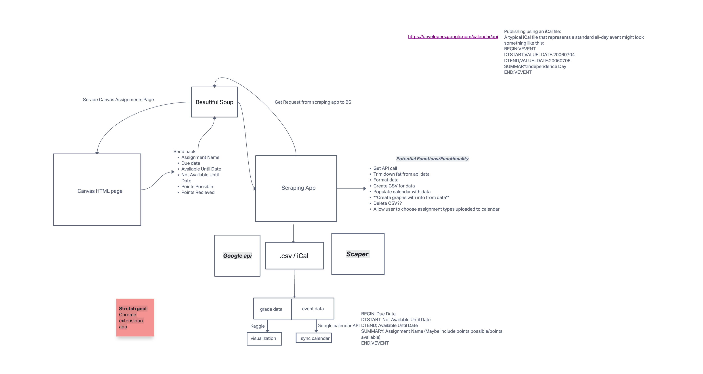

# Canvas Scraper

## Summary of Project
A web scraper tool that scrapes the Canvas Assignments page for assignments, due dates, and available until dates
After scraping, it takes the data and uploads it to your personal calendar (Google Calendar, Apple Calendar, and/or something else)
Canvas assignments/calendar are important when enrolled in a course but they are isolated to the canvas web app. 
Our application will allow users/students to bring that information to their own personal time management app for 
a more personalized/assessable experience

## UML DOM

