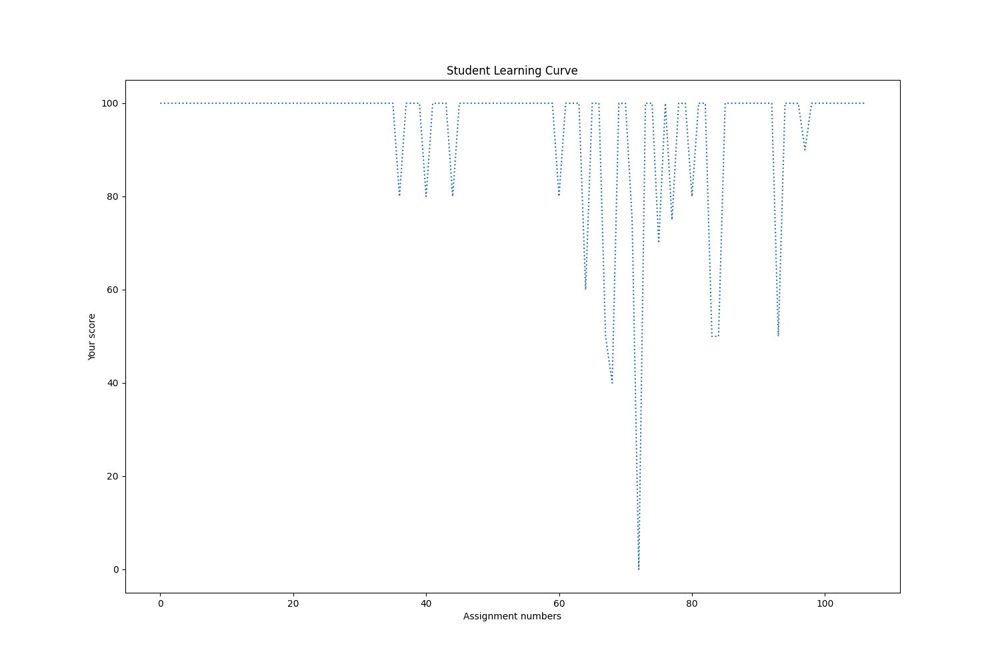

## Your score status report

### Learning curve

Displays your assignment scores by categories in a row.

### score comparison by categories

Bar charts to show your individual score compare with class mean score

**Your score vs class mean (Readings)**

**Your score vs class mean (Code challenges)**

**Your score vs class mean (Career assignments)**

**Your score vs class mean (Labs)**

